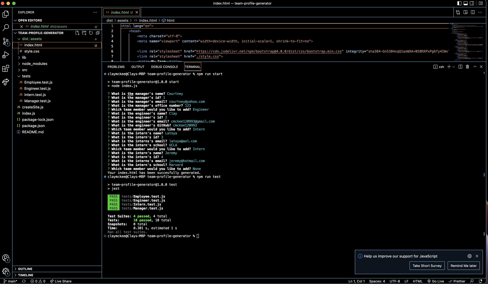

# Team Profile Generator

## Description
  
This project allows a software/web development team to create a profile for each member that includes their role, id and email (for each team member). For manager's, you get to see their office number. For engineers, you get to see their GitHub (with a functioning link). For interns, you get to see their school. All emails are linked and open up your computer's email application. The project uses Inquirer to prompt the readers with questions in the terminal via Node.js. JavaScript then processes the answers and uses the file system to create an HTML page and generate it into the "dist" folder. The main functionality is on the index.js, while the createSite.js is where the HTML is generated before being sent back to the index.js and being written to a file. A css file is linked to the HTML and in the assets folder alongside images for the icons. In addition to the generator, I used Jest in node.js to conduct tests to assure the functionality of the created classes and profiles. 
 
 ## Table of Contents
 * [Usage](#usage)
 
 ## Usage
  
 In order to use this repo, navigate to the "team-profile-generator" folder in your terminal and run "npm run start". You will then be prompted with questions in your terminal. Upon answering, your HTML will be generated and sent to the "dist" folder where you will be able to access your new site. You can run tests using "npm run test" to assure that everything is in functioning order. 
 
## Questions 

 If you have any questions, email me at cmckee120993@gmail.com. 

 You can view more of my work at [cmckee120993](https://github.com/cmckee120993).

## Site in Action

Click on the screenshot above to be taken to a video recording of this project in action.